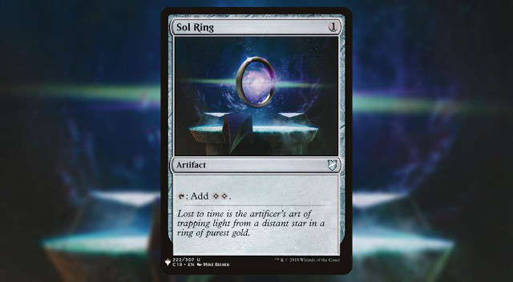
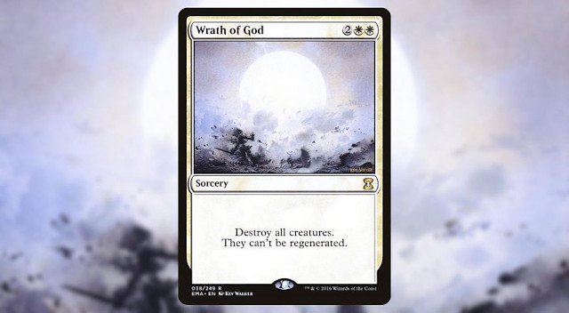
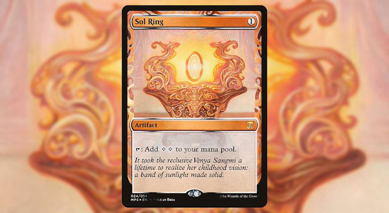
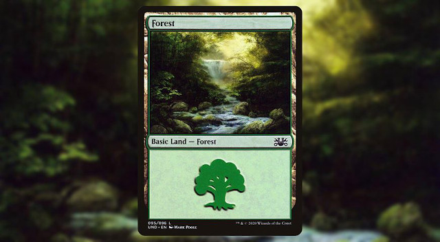
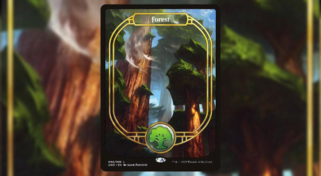
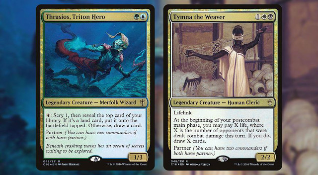
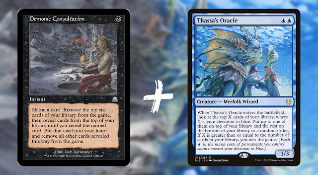
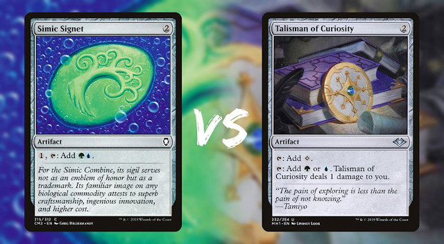
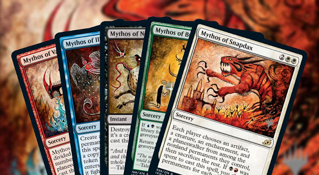

# MTG Messenger Bot

- [Usage](#usage)
- [Basic examples](#basic-examples)
  * [1. Single card](#1-single-card)
  * [2. Single card from a specific set](#2-single-card-from-a-specific-set)
  * [3. Specific card from a specific set](#3-specific-card-from-a-specific-set)
  * [4. Random cards](#4-random-cards)
- [Advanced examples](#advanced-examples)
  * [1. Two cards, side by side](#1-two-cards-side-by-side)
  * [2. Two-cards combo](#2-two-cards-combo)
  * [3. Two-cards battles](#3-two-cards-battles)
  * [4. Three, four and five cards hands](#4-three-four-and-five-cards-hands)

## Usage

1. Open Facebook Messenger
2. Start a new discussion either by navigating to https://m.me/108575720841085 or by scanning this qrcode

3. Press `Get Started` button

## Basic examples

### 1. Single card

You can render a single card by typing either it's full name:

**💡 Example :** `sol ring`

or part of it's full name if there's no ambiguity:

**💡 Example :** `wrath god`

### 2. Single card from a specific set

If you want to render a card from a specific set, you can prefix the name with the set code:

**💡 Example :** `mps sol ring` (will render Sol Ring from the _Kaladesh Inventions_ set)

### 3. Specific card from a specific set

Some sets contain cards with different illustrations. If you want a specific card, you can specify the set code and the collector number:

**💡 Example :** `und forest` (will render the basic Forest from the _Unsanctioned_ set, collector number 95)

**💡 Example :** `und 96` (will render the full art Forest from the _Unsanctioned_ set, collector number 96)

### 4. Random cards

The chatbot can also rander random cards. To do that, you still have to guide it through the kind of card you are looking for.

**💡 Example :** `🤴` (will render a random legendary creature)

**💡 Example :** `🤴 🧟` (will render a random legendary zombie creature)

Here is the list of all supported emojis:

| Emoji |   Type    |
|:-------:|:-----------:|
|  🤴  | commander |
|  👸  | commander |
|  🧟  | zombie    |
|  🧙  | wizard    |
|  🧛  | vampire   |
|  🧜  | merfolk   |
|  🧚  | faerie    |
|  🧝  | elf       |
|  🐒  | monkey    |
|  🐵  | monkey    |
|  🧞  | djinn     |
|  🦖  | dinosaur  |
|  🦕  | dinosaur  |
|  ⚔️   | warrior   |
|  🐿️  | squirrel  |
|  🕷️  | spider    |
|  🐉  | dragon    |
|  🐲  | dragon    |
|  🐙  | octopus   |
|  🦑  | kraken    |
|  👼  | angel     |
|  👻  | spirit    |
|  👹  | demon     |
|  👿  | demon     |
|  😈  | demon     |
|  👺  | goblin    |
|  🐈  | cat       |
|  🐱  | cat       |
|  🐦  | bird      |
|  🦀  | crab      |
|  🐗  | boar      |
|  🐍  | snake     |
|  ☠️   | skeleton  |
|  💀  | skeleton  |
|  🌲  | treefolk  |
|  🎄  | treefolk  |
|  🌳  | treefolk  |
|  🌴  | treefolk  |
|  🐻  | bear      |
|  👁️ | homunculus |
|  ☄️  | sorcery    |
|  ⚡  | instant    |
|  🐾 | creature   |
|  ❄️  | snow       |

## Advanced examples

### 1. Two cards, side by side

If you want to render two cards, side by side, just type two queries on two lines:

**💡 Example :**\
`Thrasios, Triton Hero`\
`Tymna the Weaver`

### 2. Two-cards combo

If you want to render a two-cards combo, you can seperate the two queries by the `+` sign:

**💡 Example :** `Demonic Consultation + Thassa Oracle`

### 3. Two-cards battles

If you want showcase a battle between two cards, you can seperate the two queries by the `vs` sign:

**💡 Example :** `Simic Signet vs Talisman of Curiosity`

### 4. Three, four and five cards hands

If you want to render a hand of three, four or five cards, just type the queries on seperate lines:

**💡 Example :**\
`Mythos of Vadrok`\
`Mythos of Illuna`\
`Mythos of Nethroi`\
`Mythos of Brokkos`\
`Mythos of Snapdax`

